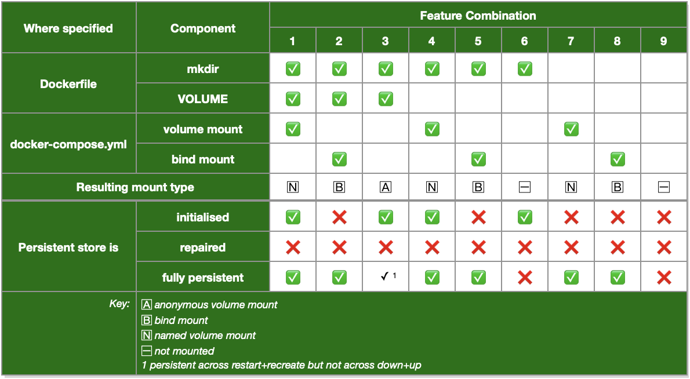
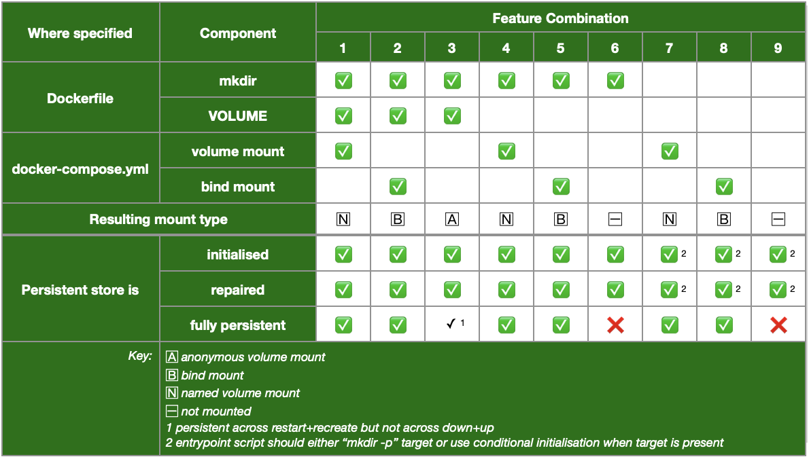

# Docker volume explorer

This repository doesn't "do" anything in a practical sense. It will, however, help you understand the nuances of Docker's *volume* and *bind* mounts.

To use this repository:

1. Clone the repository from GitHub:

	``` console
	$ git clone https://github.com/Paraphraser/docker-volume-explorer.git ~/docker-volume-explorer
	```

2. Change into the cloned directory:

	``` console
	$ cd ~/docker-volume-explorer
	```

<a name="runtest1"></a>
# test 1

Run the following command:

``` console
$ ./run_test_with_self_repair.sh false
```

The command builds two containers (`test1` and `test2`). In its service definition, each container declares three *named volume mounts* plus three *Docker bind mounts.*

The Dockerfile used to build both containers declares three internal paths on a `VOLUME` statement. A set difference between the *named volume mounts* declared in the service definition, and the internal paths declared in a `VOLUME` statement results in one *anonymous volume mount* (`vol3`).

The `false` argument passed to `run_test_with_self_repair.sh` disables each container's self repair code. This lets you see how each container's persistent stores would be initialised if you only used the standard features available to you in Dockerfiles and service definitions.

Table 1 summarises the basic behaviour of Docker *volume* and *bind mounts* in the absence of self-repair code. 

| <a name="table1"></a>Table 1: Docker volume behaviour - without self-repair |
|---------|
||

Here's an interpretation of the feature combinations in column 1 (aka `vol1`):

1. Assume that the Dockerfile:

	- creates the internal path with a `mkdir`.
	- declares the internal path in a `VOLUME` statement.

2. Assume that each container's service definition in the compose file maps a *volume mount* to the internal path.
3. The resulting mount type is a *named volume mount.*
4. The persistent store:

	- can be initialised by Docker when the *named volume mount* is created the first time the container is launched;
	- won't be auto-repaired by Docker on subsequent container launches; but
	- is fully persistent across container downs and ups.

When you distill the essence of Table 1, you find that:

- Only *volume mounts* (named or anonymous) can be initialised by Docker on first run;
- *Anonymous volume mounts* are the result of an internal path being declared in a Dockerfile `VOLUME` statement but then not being mentioned in the service definition. Their content persists but only up to a point;
- Aside from the curious question of *anonymous volume mounts,* if you don't mention an internal path in a `volumes:` clause in the service definition then the path only exists inside the container and doesn't persist; and
- Other than the one-time initialisation of *volume mounts,* there is no self-repair of persistent stores.

Run the following commands:

``` console
$ docker exec test1 tree /internal/vol1
```

Notice how the content of the `vol1` directory only includes files contributed by the `test1` container. Although the `test1` and `test2` containers have identical `volumes:` declared in their service definitions, `test2` was unable to make any contribution to the *volume mount.* Sharing is sometimes given as a reason for preferring *volume mounts* over *Docker bind mounts.* It's "sharing" but only up to a point and, as you'll see later, when it comes to "sharing" there is no difference between *volume mounts* and *Docker bind mounts.*

> This is a *slightly* artificial situation. The compose file includes a `depends_on` clause for the `test2` container which is intended to ensure that the `test1` container is started first. In the absence of formal dependencies, the order in which containers start is not predictable.

Now run:

``` console
$ docker exec test1 rm /internal/vol1/vol1.test1-pre-greeting
$ docker exec test1 tree /internal/vol1
$ docker compose restart test1
$ docker exec test1 tree /internal/vol1
```

Notice how `vol1.test1-pre-greeting` is not re-created by the `restart`. The file will not be re-created even if you down and up the stack:

``` console
$ docker compose down
$ docker compose up -d
$ docker exec test1 tree /internal/vol1
```

As you will see in a minute, adding self-repair code to a container cures all of these problems.

<a name="runtest2"></a>
## test 2

You can activate the self-repair code by running the command:

``` console
$ ./run_test_with_self_repair.sh true
```

This terminates both containers, erases all persistent stores, and recreates the containers with self-repair code active.

The self-repair code logs its activities so you can see which files have been copied.

Table 2 summarises the basic behaviour of Docker *volume* and *bind mounts* in the presence of self-repair code. The feature combinations above the thick horizontal line are the same as [Table 1](#table1). Enabling self-repair results in significant differences below the line.


| <a name="table2"></a>Table 2: Docker volume behaviour - with self-repair |
|---------|
||

All internal paths are fully populated on each container launch or restart. This is independent of whether the paths are also mentioned in a `volumes:` clause in the service definition.

The only internal paths that do not persist across container launches are those not mentioned in a `volumes:` clause in the service definition. The combination shown in column 3 (aka `vol3`) is a partial exception because it results in an *anonymous volume mount.*

Run these commands:

``` console
$ tree ./volumes
$ sudo rm ./volumes/vol2/vol2.test1-pre-greeting
$ tree ./volumes
$ docker compose restart test1
$ docker logs test1
$ tree .volumes
```

What you will notice is the file `vol2.test1-pre-greeting` is removed and then recreated automatically by the `restart` command. Unlike *volume mounts* which only initialise the persistent store when it is created the first time, "self-repair" code functions every time the container starts or restarts.

Also notice how `./volumes/vol2/` is shared by both containers. It is sometimes said that only *volume mounts* can be shared between containers. Self-evidently this is not true because `vol2` is a *Docker bind mount.*

Run:

``` console
$ docker exec test1 tree /internal/vol1
```

Notice how both the `test1` and `test2` containers have been able to contribute files to the `vol1` directory. That didn't happen in the absence of self-repair ([test 1](#runtest1)).

Self-repair also works for *volume mounts.* Try it:

``` console
$ docker exec test1 rm /internal/vol1/vol1.test1-pre-greeting
$ docker exec test1 tree /internal/vol1
$ docker compose restart test1
$ docker logs test1
$ docker exec test1 tree /internal/vol1
```

The self-repair code has reinstated `vol1.test1-pre-greeting`. In other words, self-repair works irrespective of how an internal path is mapped to the host file system.

## Scripts

### explore bind mounts

Usage:

- `$ ./explore_bind_mounts.sh`

Checks for the existence of `./volumes` then runs:

``` console
$ tree -apug --noreport ./volumes
```

### explore container mounts

Usage:

- `$ ./explore_container_mounts.sh`

Uses `docker exec` to invoke `explore_container_mounts.sh` inside the `test1` and `test2` containers. The script *inside* each container iterates the contents of the `/internal` directory and reports on whether the item is the target of a *Docker bind mount,* plus itemises its content.

### explore volume mounts

Usage:

- `$ ./explore_volume_mounts.sh`

Iterates the list of *volume mounts* and itemises the content of each.

<a name="resetsh"></a>
### reset

Usage:

- `$ ./reset.sh`

Performs the following actions:

* Takes the stack down.
* Removes all *volume mounts* (named or anonymous) and all *Docker bind mounts.*

### run test with self repair

Usage:

- `$ ./run_test_with_self_repair.sh {false|true}`

Performs the following actions:

* Invokes [`reset.sh`](#resetsh).
* Invokes `docker compose up --build -d` which rebuilds the containers (if needed) and starts the stack.
* Invokes `docker logs` on each container to write log entries to `stdout`.

If the argument is:

* `false` (or omitted), starts each container with self-repair code disabled.
* `true`, starts each container with self-repair code enabled.
* otherwise displays a "usage" statement.

### show declared volumes

Usage:

- `$ ./show_declared_volumes.sh`

Iterates all images known to the host. For each image, reports on any internal paths which have been declared on a `VOLUME` statement in the Dockerfile.

Reports `null` where an image was constructed without using `VOLUME` statements in its Dockerfile.
